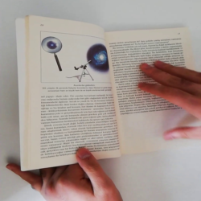

# Introduction
This is a project about image **binary classification**.

There is a **labeled dataset with images** of a book open at different pages (read the `README.md` to get more information on how to download the images). Some of them are being flipped, and some of them are not.

The purpose is to build a model that predicts whether a given image shows a page being flipped or not.

A **CNN** (Convolutional Neural Network) has been created with **PyTorch**.

The preprocessing of images, training, validation and testing has been carried out using the package **PyTorchLightning**, which makes all the process much easier and replicable.

Given the amount of images, the computation can be quite expensive computationally. That is why I have used a compute instance with **GPU** in Azure to run this Notebook.

The results on the test dataset are astonishingly good. I have also used custom images with a book that is not present in the training dataset, which had kind of OK results, showing the extent of the overfitting of the model since only one book was used to train the neural network.

Finally, the model has been deployed to two **Microsoft Azure ML endpoints** and have been used to perform some predictions which, of course, are similars to the ones using the model in this Notebook. One of the endpoints is a **batch endpoint**, for which I used a compute instance with a GPU (and hence CUDA is available). The other endpoint is an **online real time endpoint**, for which I used a compute instance with only CPU (no GPU).

For deploying to the batch endpoint I have used the **Python SDK for Azure ML**.

The framework **MLFlow** has been used for logging the model to Azure ML easily, and also for deploying it to the online real time dataset. This way we show how MLFlow allows for an agnosting deployment (independent of the platform: Azure, AWS, GCP, etc.) and how much verbosity we remove with respect the native Azure ML Python SDK, which is of course much more powerful but too verbose in consequence.

# Visualize the notebook
Visualize the [notebook](https://nbviewer.org/github/rubchume/FlipPageDetectorCNNAzure/blob/main/Project%204%20-%20MonReader.ipynb)

# Images
The images for this project can be downloaded from [here](https://drive.google.com/file/d/1KDQBTbo5deKGCdVV_xIujscn5ImxW4dm/view?usp=sharing).
